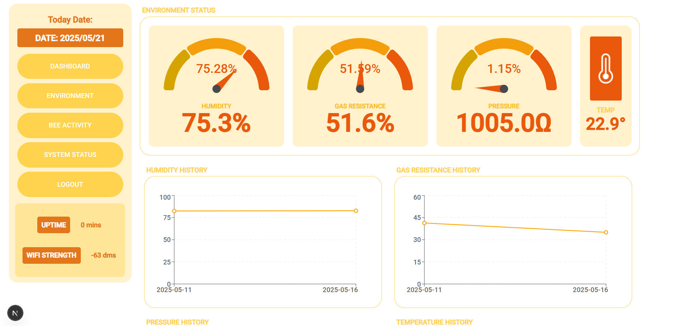
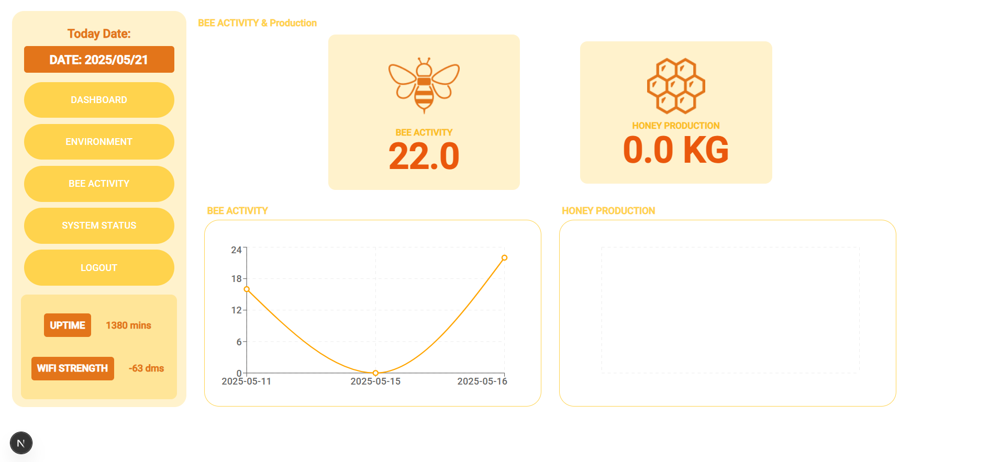
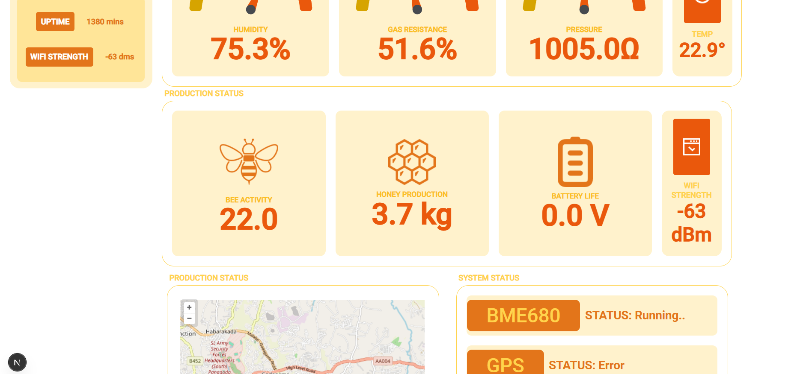
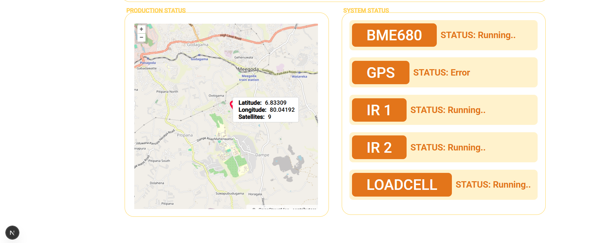
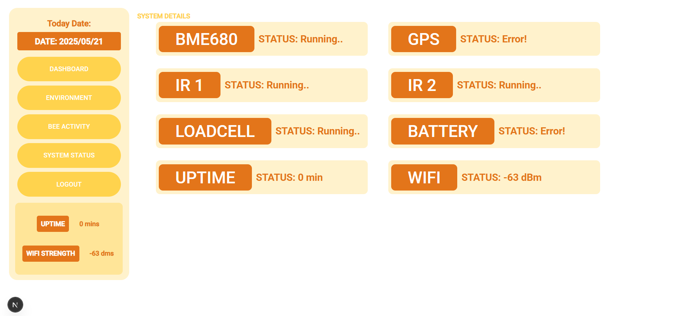

## Key Screens of the Dashboard

### Environmental Monitoring

  

### Bee Activity Analysis

  

### Weight Tracking

  

### Real-Time Location

  

### System Status

  

## Quick Setup

For detailed setup instructions, please refer to the dashboard repository. In brief:

1. Clone the dashboard repository
2. Install dependencies (`npm install`)
3. Configure Firebase credentials in `.env.local`
4. Run the development server (`npm run dev`)