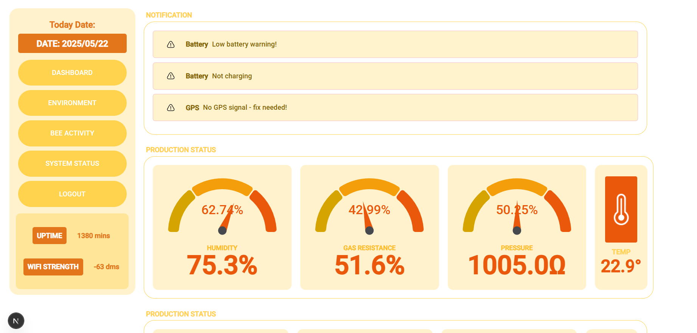

# 🐝 Smart Beehive Management Dashboard

> 🖥️ Real-time web interface for monitoring beehive data collected by the [Smart Beehive Monitoring Dashboard](https://github.com/deaneeth/Smart-Beehive-Monitoring-Dashboard)

<p align="center">
  
</p>

<p align="center">
  <a href="https://your-demo.vercel.app">
    
  </a>
  <a href="https://github.com/deaneeth/Smart-Beehive-Monitor-System">
    
  </a>
</p>

## ✨ Features

- 📊 **Real-time Data Visualization** - Live updates of all hive metrics
- 📈 **Historical Analysis** - Track trends and patterns over time
- 🐝 **Bee Activity Monitoring** - Entrance/exit activity tracking
- ⚖️ **Weight Monitoring** - Track honey production and hive health
- 🌡️ **Environmental Tracking** - Temperature, humidity, and air quality
- 🚨 **Alert System** - Instant notifications for predator detection
- 🗺️ **GPS Location** - Track hive locations on interactive maps
- 🔋 **Power Monitoring** - Solar panel and battery status

## 🛠️ Technologies Used

- **Frontend**: React, Next.js, TypeScript
- **Database**: Firebase Realtime Database
- **Maps**: Leaflet
- **Charts**: React Gauge Charts, Recharts
- **Styling**: Tailwind CSS

## 🚀 Getting Started

### Prerequisites

- Node.js (v14 or higher)
- npm or yarn
- Firebase account
- [Smart Beehive Hardware](https://github.com/deaneeth/Smart-Beehive-Monitor-System) (optional for demo)

### 📦 Installation

1. **Clone the repository**
```
git clone https://github.com/deaneeth/Smart-Beehive-Monitor-System-Dashboard
cd Smart-Beehive-Monitor-System-Dashboard
```

2. **Install dependencies**
```
npm install
# or
yarn install
```
3. **Configure environment variables**
```
cp .env.example .env.local
```

4. **Update .env.local with your Firebase configuration**
```
NEXT_PUBLIC_FIREBASE_API_KEY=your_api_key
NEXT_PUBLIC_FIREBASE_AUTH_DOMAIN=your_auth_domain
NEXT_PUBLIC_FIREBASE_DATABASE_URL=your_database_url
NEXT_PUBLIC_FIREBASE_PROJECT_ID=your_project_id
```

5. **Run the development server**
```
npm run dev
# or
yarn dev
```

6. **Open http://localhost:3000 🎉**


## 🔗 Integration with IoT Hardware
This dashboard is designed to work seamlessly with the Smart Beehive Monitoring System:

- ESP32-based monitoring system
- Multiple sensor integration (BME680, HX711, TCRT5000, etc.)
- Solar-powered operation
- Real-time data transmission via Firebase

For detailed setup instructions, see [DASHBOARD-PREVIEW.md](https://github.com/deaneeth/Smart-Beehive-Monitor-System-Dashboard/blob/main/DASHBOARD-PREVIEW.md)

## 🤝 Contributing
Contributions are welcome! Please feel free to submit a Pull Request.

## 📄 License
This project is licensed under the MIT License - see the [LICENSE] file for details.


> Made with ❤️ for the beekeeping community
